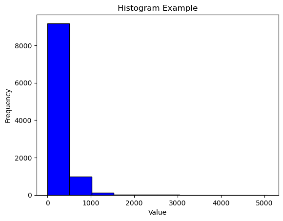

# Book Genre Detector using traditional ML Models as well as Deep Learning and NLP

## Preprocessing

Two datasets were found for the development of the project: BooksDataSet.csv from [GitHub](https://github.com/chikne97/Book-Genre-Prediction/tree/master) and booksummaries.txt from [CMU](https://www.cs.cmu.edu/~dbamman/booksummaries.html). The first dataset is a preprocessed version of the second.

In a first pass through the models, the first model resulted incomplete to be used for deep learning for having only 500 samples per category, so some processing was made in the first dataset to add samples.

After adding the extra samples the resulting dataset comes as follows:

Each summary requires some preprocessing to be able to be sent to any classification model. For this, some basic NLP processing is done. For our case the process is as follows:
1. Tokenization of sentences
2. Filter of special characters
3. Tokenization of words
4. Stemming and lemmatization of words
5. removal of stop_words

After this first iteration we obtain the following preliminary results:

We can see that there are still several words that are undesirable like "hi" and "ha" which provide no real meaning in determining the significance in the summary.

Plotting these per genre in a wordcloud we obtain the following:

Because of this, the next step was decided:

6. **Manual cleansing of other undesired words**

This process is iterative sindce when removing some of the most frequent words then others take their place and may or may not be important fot determining their importance in the classification. After removing the most present words that don't have any significance, we get the following plots:

There is a clear tendency for some words in english literature with words like "kill", time and new being one of the most repeated. Anyhow, we can now see better some words that are genre defining. One the most clear is science fiction where we can find words like planet, human, alien and such which are common topics discussed in those kinds of novels. THe same happens with others like Crime Fiction where kill, murder and investigate are present really frequently.

## ML Models

Just for the sake of determining if the extra manual processing was benefitial, each model has been run with the regular processing from steps 1 to 5 and again with step 6 included and we will compare accuracies.

The models selected for this analysis are RandomForest, SVM and LogisticRegression. LogisticRegression adn SVM are more common in this type of scenarios but regular ensembles looked interesting to check. 

In terms of preprocessing, a TF-IDF was applied to the summaries to obtain the importance of a word in the summary relative to the collective. This way we can determine which words might be important for one genre but not for the rest, and not just the ones that are most frequent.

For each model, a hyperparameter tunning was carried out to determine which configuration of each model works best for each kind of data. This was done thorugh either GridSearch or OptunaSearch.
The results are as following:

### Random Forest

Final parameters for regular dataset:
+ 'max_depth': 50
+ 'max_features': 'sqrt'
+ 'min_samples_leaf': 1
+ 'min_samples_split': 2
+ 'n_estimators': 1500

Obtaining the following results:

Final parameters for cleaned dataset:
+ 'max_depth': 50
+ 'max_features': 'sqrt'
+ 'min_samples_leaf': 1
+ 'min_samples_split': 5
+ 'n_estimators': 1000

Obtaining the following results:

We find both models coming out as pretty similar, with no big differences but the number of estimators. Furthermore, the accuracies in test are both extremely similar rounding 55%. From the results of both we can see that some genres are much more difficult to predict than others. For example, in science fiction the models tend to overpredict them, meaning they usually catch the science fiction books, but others that aren't are missclassified. This can be because of various factors, one maybe due to the imbalance of the dataset as, for example, Horror has perfect accuracy yet pretty bad recall as the model isn't looking for it as much as others. 

### Logistic Regression

We repeat the previous process for logisitc regression, where we get the following resutls for each dataset:

Regular Dataset:

Cleaned Dataset:

Here we get a better result than with randomForest with higher accuracies over all as well as better f1-scores, shwoing why this model is generally better suited for this types of problems.

### SVM

Here, another hyperparameter tunning was made, obtaining the following results:

Regular Dataset:
+ 'C': 1
+ 'kernel': 'poly'
+ 'degree': 1
+ 'gamma': 'scale'
+ 'shrinking': True
+ 'probability': True

Cleaned Dataset:
+ 'C': 1
+ 'kernel': 'linear'
+ 'degree': 3
+ 'gamma': 'scale'
+ 'shrinking': False
+ 'probability': False

This model offers the best performance in terms of accuracy, while LogisitcRegression is overall a faster model in terms of trainning and predictions. Overall we can see that the extra preprocessing came as unnecesary considering that the TF-IDF almost "filters" out the most common useless words, so this hasn't generated any considerable advantage. 

## DeepLearning Models

For DeepLearning models we have decided to follow a similar preprocessing as it is done in the IMBD dataset. This means that for all summaries, each one has been tokenized and each word has been assigned a number based on its frequency on the texts (capturing only the 10000th most common words). Then, for standardizing the size for input in the neural network, padding has been applied to make sure all summaries are 1000 tokens long. This number has been determined by looking at the histogram of lengths of summaries, nmaking sure most of the summaries didnt get cut:

After this, training and testing was conducted. First, a simple LSTM network was tried, but due to the low amounts of data and overall characteristics of the network, the performance was abominal, being discarded directly. After this, a regular Dense neural network was tried, making sure to try various configurations. The configurations tried are between these parameters:

+ n_neurons: 32 to 256
+ activation function: relu or tanh
+ dropout rate: 0 to .8
+ optimizer function: adam or sgd
+ n_layers: 2 to 8
+ learning_rate: 1e-4 to 1e-2

The hyperparameter tunning was made using keras-tuner and its BayesianOptimization. 600 trials were carried out for  50 epochs with EarlyStopping monitoring the validation accuracy. After completing all trials the resulting best model is as follows:

With parameters:
+ n_neurons: 192
+ activation: 'tanh'
+ dropout rate: 0.2
+ optimizer: 'adam'
+ n_layers: 8
+ 'lr': 0.00725917251583102

In this case the accuracy doesn't improve over 20% meaning that either this model is too complex for the task, or the data is not enough for it to be trained properly.

## Conclusions

After examining several models and more that didn;t make the cut, this use case of text processing shows that, at least for the datasets used, ML models are better suited, and DeepLearning ones require an amount of data that is not available for our use case. 

Started with BooksDataSet but too low data 
High Precision on Models